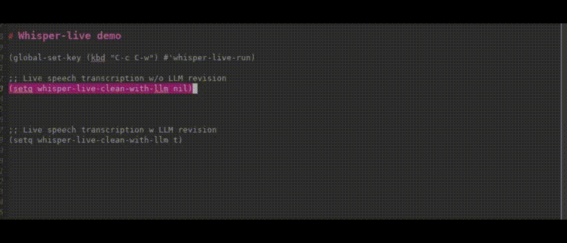

<!-- ---
!-- title: ./whisper-live/README.md
!-- author: ywatanabe
!-- date: 2024-12-07 16:43:14
!-- --- -->


# whisper-live.el

Real-time speech transcription in Emacs using Whisper.



## Prerequisites

- Emacs 27.1 or later
- whisper.el (https://github.com/natrys/whisper.el)
- OpenAI Whisper installed and in PATH
- (Optional) Anthropic API key for Claude enhancement

## Installation & Configuration
```elisp
(use-package whisper-live
  :load-path "/home/ywatanabe/.emacs.d/lisp/whisper-live"  ; Changed to whisper-live path
  :after whisper
  :bind (("M-RET" . whisper-live-run)
         )
  :config
  (setq whisper-install-directory "~/.whisper"
        whisper-model "base"
        whisper-language "en"
        whisper-translate nil
        whisper-use-threads (/ (num-processors) 2)
        whisper-quantize "q4_0"
        whisper-live-clean-with-llm t ; Optional
        whisper-live-anthropic-key (or (getenv "ANTHROPIC_API_KEY") "") ; Optional
        whisper-live-anthropic-engine "claude-3-5-haiku-20241022" ; Optional
        whisper-live-llm-prompt "Clean up the following raw text transcribed from audio. Fix minor errors to produce natural language output. As long as meaning is remained, you can revise as a English native speaker. Respond with only the corrected text and NEVER INCLUDE YOUR COMMENTS. Now, the raw transcription is as follows: \n" ; Optional: will precede the raw transcription to construct full prompt
        ))
```

## Usage

Start & stop transcription with:
```elisp
M-x whisper-live-run
```

## Contact
ywatanabe@alumni.u-tokyo.ac.jp
