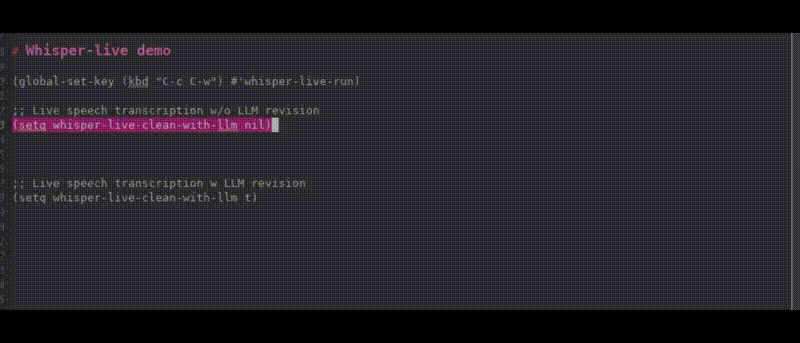

<!-- ---
!-- Timestamp: 2025-04-18 07:03:51
!-- Author: ywatanabe
!-- File: /home/ywatanabe/.emacs.d/lisp/whisper-live/README.md
!-- --- -->

<!-- ---
!-- title: ./whisper-live/README.md
!-- author: ywatanabe
!-- date: 2024-12-07 16:43:14
!-- --- -->


# whisper-live.el

Real-time speech transcription in Emacs using Whisper.



Version 1.4 can continuously revise a provisional transcript as more audio
context arrives, run Whisper locally or over SSH on a GPU host, and finish the
last partial recording before optionally submitting input in `vterm`.

## Prerequisites

- Emacs 27.1 or later
- whisper.cpp (the bundled whisper.el integration can install it)
- FFmpeg
- (Optional) Anthropic API key for Claude enhancement
- (Optional) SSH access to a remote transcription worker

## Installation & Configuration

#### whisper-live
```elisp
(use-package whisper-live
  :load-path "/path/to/this/directory"  ; Changed to whisper-live path
  :after whisper
  :bind (("M-RET" . whisper-live-run)
         )
  :config
  (setq whisper-install-directory "~/.whisper"
        whisper-model "base"
        whisper-language "en"
        whisper-translate nil
        whisper-use-threads (/ (num-processors) 2)
        whisper-quantize "q4_0"
        whisper-live-clean-with-llm t ; Optional
        whisper-live-anthropic-key (or (getenv "ANTHROPIC_API_KEY") "") ; Optional
        whisper-live-anthropic-engine "claude-3-5-haiku-20241022" ; Optional
        whisper-live-llm-prompt "Clean up the following raw text transcribed from audio. Fix minor errors to produce natural language output. As long as meaning is remained, you can revise as a English native speaker. Respond with only the corrected text and NEVER INCLUDE YOUR COMMENTS. Now, the raw transcription is as follows: \n" ; Optional: will precede the raw transcription to construct full prompt
        ))
```

For continuous prose that improves earlier wording as context grows:

```elisp
(setq whisper-live-transcription-mode 'accumulative
      whisper-live-accumulative-revise-text t
      whisper-live-number-chunks nil
      whisper-live-unnumbered-separator " "
      whisper-live-accumulative-max-duration 120
      whisper-live-accumulative-stop-at-max-duration t)
```

To send inference to a faster host, install
`scripts/whisper-live-remote-worker` there as
`~/.local/bin/whisper-live-transcribe`, install
`scripts/whisper-live-whisper-cli` as `~/.local/bin/whisper-live-whisper-cli`,
then configure:

```elisp
(setq whisper-live-remote-host "gpu-host.example"
      whisper-live-remote-model "large-v3-turbo-q5_0")
```

Set `whisper-live-remote-host` back to nil to use local whisper.cpp.

## Usage

Start & stop transcription with:
```elisp
M-x whisper-live-run
```

## Contact
ywatanabe@alumni.u-tokyo.ac.jp

<!-- EOF -->
